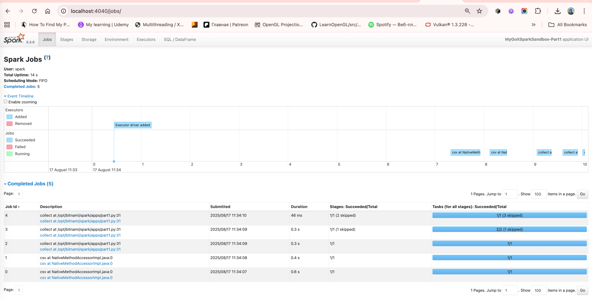
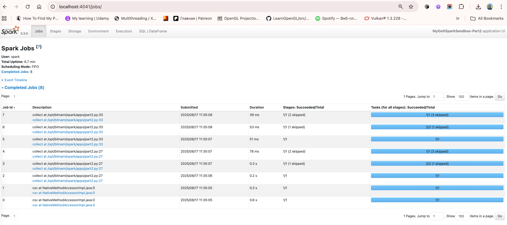
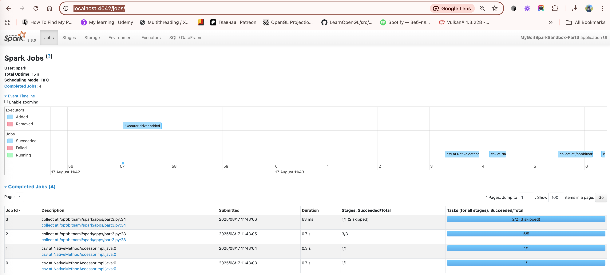

# Домашнє завдання до теми «Apache Spark. Оптимізація та SparkUІ»

 - Job з’являється щоразу, коли робиться Action (collect, count, show, запис у файл тощо).
 - Transformations (типу where, select, groupBy, repartition) - ледачі; вони лише будують DAG.
 - Одне Action може містити кілька Stage (через вузькі/широкі перетворення). Але в цій ДЗ рахують саме Jobs.

## Part 1 (5 Jobs)

Головний ACTION - один: collect() наприкінці.
Але Spark може створити кілька Jobs, пов’язаних з:
 - читанням CSV із inferSchema (окремий прохід),
 - шафлом від groupBy().count() і т. ін.

## Part 2 (8 Jobs)

 - Додається проміжний collect() ДО фільтра where("count > 2").
 - Кожний collect() - новий Job.

Без cache Spark перераховує весь попередній DAG з нуля для кожного collect().
Тому отримується кілька додаткових Jobs.

## Part 3 (4 Jobs, менше ніж у Part 2)

 - Додається .cache() на результат агрегування (до фільтра count > 2).
 - Перший collect() робить кеш (один набір Jobs).
 - Другий collect() після where("count > 2") бере дані з кешу, не перераховуючи весь DAG від джерела.

Отже загальна кількість Jobs менша, ніж у Part 2.